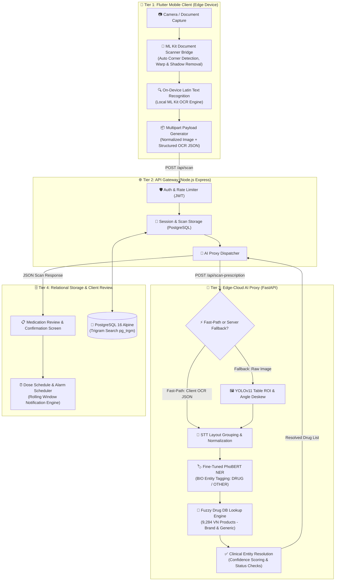

# MedicineApp: On-Device Document Intelligence & Edge-Cloud Biomedical NER for Clinical Prescription Digitization

[](https://opensource.org/licenses/MIT)
[](https://www.python.org/)
[](https://nodejs.org/)
[](https://flutter.dev/)
[](https://www.postgresql.org/)
[](https://www.docker.com/)
[](REPRODUCIBILITY.md)

---

## 📖 Overview

**MedicineApp** is an end-to-end, edge-cloud hybrid mobile health (mHealth) prescription digitization and medication adherence platform. The system addresses the open clinical challenge of digitizing non-standardized, noisy outpatient prescriptions captured under realistic mobile camera conditions (geometric skew, optical distortion, shadows, partial fields of view, and multi-column tabular layouts).

By coupling **on-device Google ML Kit Document Scanner & Latin Text Recognition** with an **edge-cloud PhoBERT Named Entity Recognition (NER)** model and a **fuzzy database lookup engine containing 9,284 standardized Vietnamese pharmaceutical products**, MedicineApp eliminates server OCR overhead while achieving high precision and clinical safety.

```
┌─────────────────────────────────────────────────────────────────────────────────────────┐
│                                SYSTEM ARCHITECTURE OVERVIEW                             │
├──────────────────────────┬─────────────────────────────┬────────────────────────────────┤
│ 1. Mobile Edge Client    │ 2. Application Gateway      │ 3. Edge-Cloud AI Inference     │
│  - ML Kit Document Scan  │  - Express 4.x / JWT Auth   │  - STT Sequence Grouping       │
│  - On-Device Latin OCR   │  - PostgreSQL 16 / Trigram  │  - PhoBERT Clinical NER        │
│  - Local Alarm Scheduler │  - Drug Interaction Checks  │  - 9,284 DAV Drug Fuzzy Match  │
└──────────────────────────┴─────────────────────────────┴────────────────────────────────┘
```

---

## 🏗️ System Architecture

MedicineApp employs a tiered microservices architecture with a dual-stage progressive pipeline:



---

## ✨ Key Features

1. **Edge-Cloud Hybrid OCR (Fast-Path)**:
   - On-device document normalization and Latin OCR extracts bounding boxes and text tokens entirely offline on mobile hardware, transferring $0\text{ MB}$ OCR compute load to the backend server.
2. **Progressive OCR & Layout Reconstruction ($P0-P3$)**:
   - Resilient geometry adapter (`core/classify/stt_grouping.py` & `core/classify/mlkit_layout_adapter.py`) groups horizontal and multi-column tokens by sequence order anchors (STT: *Số Thứ Tự*), preventing line wrap fragmentation.
3. **Domain-Specific PhoBERT NER**:
   - `vinai/phobert-base-v2` fine-tuned on clinical prescription syntaxes with token classification (BIO tagging), isolating drug names from dosage, frequency, and usage instructions.
4. **Authoritative Drug Registry & Resolution Safety**:
   - Fuzzy search against **9,284 official Drug Administration of Vietnam (DAV)** registered medications (`data/drug_db_vn_full.json`), matching both proprietary brand names (`tenThuoc`) and active generic pharmaceutical ingredients (`hoatChat`).
5. **Cross-Medication Interaction & Safety Warnings**:
   - Real-time safety validation checks for adverse drug-drug interactions before schedule creation.
6. **Resilient Medication Adherence & Scheduling**:
   - Flutter client configures exact Android alarms (`flutter_local_notifications` + `timezone`) with rolling 3-day window scheduling, surviving device reboots via `BOOT_COMPLETED` receivers.
7. **One-Command Reproducible Microservices**:
   - Fully containerized PostgreSQL 16, Node.js API Gateway, and CPU-optimized FastAPI AI Proxy with automated migrations and seed ingestion.

---

## 📂 Repository Structure

```
medicineApp/
├── core/                        # Python AI Core Modules
│   ├── classify/                # STT Grouping, PhoBERT NER, Layout Adapter
│   ├── drug_search/             # Fuzzy Drug Lookup Engine (9,284 drugs)
│   ├── config.py                # Pipeline Path & Hardware Configurations
│   └── pipeline.py              # Main Dual-Stage Pipeline Orchestrator
│
├── mobile/                      # Flutter Android Mobile Application
│   ├── android/                 # Android Native ML Kit Bridge & Manifests
│   ├── lib/                     # Clean Architecture (Domain, Providers, Screens)
│   ├── test/                    # 39 Unit, Widget, and Golden UI Tests
│   └── README.md                # Dedicated Mobile Documentation
│
├── server/                      # FastAPI Edge-Cloud AI Proxy
│   ├── main.py                  # API Routes (/api/scan-prescription, /api/health)
│   └── Dockerfile               # CPU/GPU Container Definition
│
├── server-node/                 # Node.js Express Application Server
│   ├── src/                     # Auth, Scans, Drugs, Plans, Middlewares
│   ├── tests/                   # 55 Jest Unit & Integration Tests
│   └── Dockerfile               # Production Express Node Container
│
├── data/                        # Datasets & Knowledge Bases
│   ├── drug_db_vn_full.json     # 9,284 Official Vietnamese Drug Records
│   ├── visible_in_frame_gt.json # 137 Visible-in-Frame Ground Truth Entities
│   └── human_verification_provenance_log.json # Provenance Audit Trail
│
├── models/                      # Model Weights Directory
│   ├── phobert_ner_model/       # Fine-Tuned PhoBERT NER Weights
│   └── yolo/best.pt             # YOLOv11 Table Detection Weights
│
├── reports/                     # Paper Benchmark Evaluation Outputs
│   ├── real_medication_roi_ablation/  # R0 vs R1 ROI Study Reports
│   └── real_layout_ablation/          # P0-P3 Layout Reconstruction Reports
│
├── scripts/                     # Benchmark Replication & CLI Tools
│   ├── benchmark_real_medication_roi.py # R0 vs R1 Replication Script
│   ├── benchmark_real_mlkit_layout.py   # P0-P3 Replication Script
│   ├── audit_visible_gt.py              # Ground Truth Provenance Auditor
│   └── run_pipeline.py                  # Single-Capture CLI Testing Tool
│
├── docker-compose.yml           # Unified Stack: Postgres + Node.js + FastAPI
├── docker-compose.gpu.yml       # Optional GPU-Accelerated Docker Compose Stack
├── .env.example                 # Root Environment Template
├── LICENSE                      # MIT License
├── README.md                    # This Document
└── REPRODUCIBILITY.md           # Step-by-Step Academic Replication Protocol
```

---

## ⚡ Quickstart Guide

### Option 1: One-Command Docker Compose (Recommended)

Deploy the entire backend stack (PostgreSQL 16 + Node.js API + FastAPI AI Proxy) with a single command:

```bash
# 1. Clone the repository
git clone https://github.com/hongphuoc6104/medicineApp.git
cd medicineApp

# 2. Launch containerized stack (Builds images, runs migrations, seeds drug DB)
docker compose up -d --build

# 3. Verify health status
curl -f http://localhost:3000/api/health
curl -f http://localhost:8000/api/health
```

Expected output from health checks:
```json
{"success":true,"message":"Node.js API Gateway is healthy"}
{"status":"healthy","model_loaded":true,"database_size":9284}
```

---

### Option 2: Local Development Setup

#### 1. PostgreSQL Database
```bash
docker compose up -d postgres
```

#### 2. Python FastAPI AI Proxy
```bash
# Set up Python virtual environment
python3 -m venv venv
source venv/bin/activate
pip install -r requirements.txt

# Start FastAPI AI Server (Runs on CPU by default)
uvicorn server.main:app --host 0.0.0.0 --port 8000 --reload
```

#### 3. Node.js API Gateway
```bash
cd server-node
npm install
npm run migrate
npm run seed:all
npm run dev
# Server running at http://localhost:3000 (or port configured in .env)
```

#### 4. Flutter Mobile Client
```bash
cd mobile
cp .env.example .env
flutter pub get
flutter run
```

---

## 📊 Benchmark & Evaluation Summary

All experimental tables reported below are directly replicable using the scripts in `scripts/` against the evaluation captures in `reports/` and ground truth in `data/`. For the complete replication methodology, see [REPRODUCIBILITY.md](REPRODUCIBILITY.md).

### 1. Hard Real-World Camera Capture ROI Intervention ($R0$ vs $R1$)

Evaluated on 30 difficult smartphone captures containing 137 physically visible drug entities comparing **$R0$ (Full-Page Smartphone Capture)** vs **$R1$ (Medication Table ROI Crop + Pass-2 Re-OCR)**:

| Evaluation Granularity | Condition | Visible OCR Coverage | Precision | Recall | F1 Score | Sample Size ($N$) |
| :--- | :--- | :---: | :---: | :---: | :---: | :---: |
| **Drug-Instance Micro** | **$R0$**: Full-Page Smartphone Capture | $90.51\%$ | $77.61\%$ | $75.91\%$ | **$76.75\%$** | 137 drugs |
| **Drug-Instance Micro** | **$R1$**: Medication Table ROI Re-OCR | **$92.70\%$** | **$80.74\%$** | **$79.56\%$** | **$80.15\%$** | 137 drugs |
| **Capture-Macro** | **$R0$**: Full-Page Smartphone Capture | $90.67\%$ | $77.83\%$ | $77.00\%$ | **$76.94\%$** | 30 captures |
| **Capture-Macro** | **$R1$**: Medication Table ROI Re-OCR | **$93.00\%$** | **$81.00\%$** | **$81.00\%$** | **$80.57\%$** | 30 captures |
| **Prescription-Macro** | **$R0$**: Full-Page Smartphone Capture | $97.37\%$ | $82.13\%$ | $92.07\%$ | **$86.20\%$** | 5 prescriptions |
| **Prescription-Macro** | **$R1$**: Medication Table ROI Re-OCR | **$97.98\%$** | **$84.28\%$** | **$94.34\%$** | **$88.42\%$** | 5 prescriptions |

#### Statistical Significance & Bootstrap Analysis
- **Exact 2-Sided McNemar / Binomial Test**: $b=14$ (drugs recovered by $R1$), $c=9$ (drugs missed by $R1$), $p = 0.4049$.
- **Capture-Level 95% Bootstrap Confidence Interval on $\Delta F_1$**: $[-0.92\%, +8.47\%]$ (Point Estimate: $+3.63\%$).
- **Prescription-Clustered 95% Bootstrap CI on $\Delta F_1$**: $[-3.22\%, +7.43\%]$ (Point Estimate: $+2.22\%$).

---

### 2. Real-Data ML Kit Layout Reconstruction Ablation ($P0-P3$)

Ablation study assessing geometry reconstruction strategies across development captures:

| Strategy | Micro Precision | Micro Recall | Micro F1 | Macro Precision | Macro Recall | Macro F1 |
| :--- | :---: | :---: | :---: | :---: | :---: | :---: |
| **$P0$ (Raw Text Blocks)** | $89.36\%$ | $30.02\%$ | **$44.94\%$** | $84.02\%$ | $82.36\%$ | **$78.29\%$** |
| **$P1$ (Sorted Lines)** | $89.36\%$ | $30.02\%$ | **$44.94\%$** | $84.02\%$ | $82.36\%$ | **$78.29\%$** |
| **$P2$ (Row Clusters)** | $82.79\%$ | $25.49\%$ | **$38.98\%$** | $83.16\%$ | $56.29\%$ | **$63.81\%$** |
| **$P3$ (Medication Bands)** | $90.63\%$ | $19.59\%$ | **$32.22\%$** | $85.16\%$ | $54.81\%$ | **$62.10\%$** |

---

### 3. Latency & Resource Footprint

| Component | Hardware Target | Execution Mode | Average Latency | Peak Memory |
| :--- | :--- | :--- | :---: | :---: |
| **Document Scanner & OCR** | Mobile Device (ARM64) | On-Device ML Kit | $\approx 250 - 450\text{ ms}$ | $< 35\text{ MB}$ |
| **PhoBERT NER + Drug Search** | Cloud Server (x86_64 CPU) | Fast-Path CPU | $\approx 380 - 650\text{ ms}$ | $\approx 480\text{ MB}$ |
| **End-to-End Edge-to-Response** | Network + Backend | HTTP/JSON | $\approx 850 - 1200\text{ ms}$ | - |

---

## 🔬 Reproducibility & Verification

To reproduce all experimental results reported in the paper:

```bash
# Run the complete ROI Intervention benchmark (10,000 bootstrap iterations)
source venv/bin/activate
PYTHONPATH=. python scripts/benchmark_real_medication_roi.py \
  --ocr-dir reports/real_medication_roi_ablation/mlkit_ocr \
  --visible-gt data/visible_in_frame_gt.json \
  --output-dir reports/real_medication_roi_ablation \
  --bootstrap 10000

# Run Ground Truth Provenance Audit
PYTHONPATH=. python scripts/audit_visible_gt.py \
  --annotator "Independent Reviewer" \
  --out data/human_verification_provenance_log.json
```

Detailed reproduction instructions, test suite commands, dataset checksums, and troubleshooting guides are available in [REPRODUCIBILITY.md](REPRODUCIBILITY.md).

---

## 📜 Citation

If you use MedicineApp, its datasets, or benchmark suites in your research, please cite our work:

```bibtex
@article{medicineapp2026,
  title     = {MedicineApp: On-Device Document Intelligence and Edge-Cloud Biomedical Named Entity Recognition for Clinical Prescription Digitization},
  author    = {Nguyen, Hong Phuoc and Contributors},
  journal   = {arXiv preprint / Academic Publication Submission},
  year      = {2026},
  url       = {https://github.com/hongphuoc6104/medicineApp}
}
```

---

## 📄 License & Acknowledgments

- **License**: This project is licensed under the [MIT License](LICENSE) — see the `LICENSE` file for details.
- **Acknowledgments**:
  - [Drug Administration of Vietnam (DAV)](https://dav.gov.vn/) for open pharmaceutical registration records.
  - [VinAI Research](https://github.com/VinAIResearch/PhoBERT) for the PhoBERT biomedical language model.
  - [Google ML Kit](https://developers.google.com/ml-kit) for on-device document scanning and text recognition.
