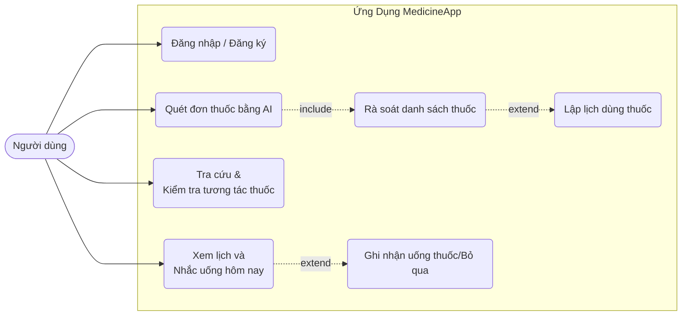

```mermaid
flowchart LR
    User([Người dùng])
    
    subgraph App[Ứng Dụng MedicineApp]
        UC1(Đăng nhập / Đăng ký)
        UC2(Quét đơn thuốc bằng AI)
        UC3(Rà soát danh sách thuốc)
        UC4(Tra cứu &<br>Kiểm tra tương tác thuốc)
        UC5(Lập lịch dùng thuốc)
        UC6(Xem lịch và<br>Nhắc uống hôm nay)
        UC7(Ghi nhận uống thuốc/Bỏ qua)
    end

    User ---> UC1
    User ---> UC2
    User ---> UC4
    User ---> UC6
    
    UC2 -.->|include| UC3
    UC3 -.->|extend| UC5
    UC6 -.->|extend| UC7
```
