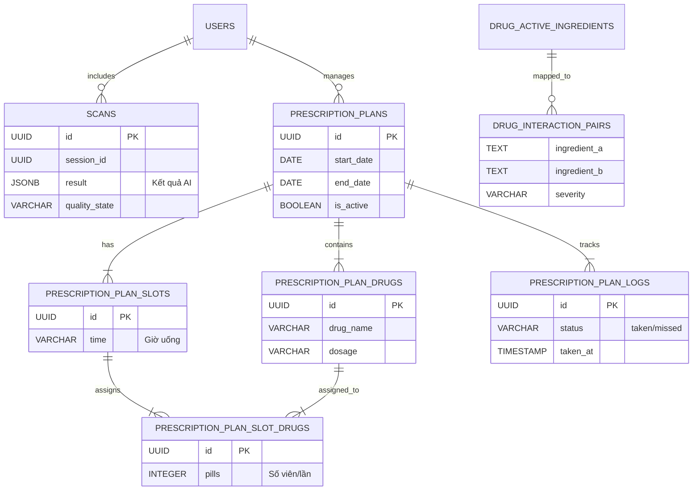

```mermaid
erDiagram
    USERS ||--o{ SCANS : "includes"
    USERS ||--o{ PRESCRIPTION_PLANS : "manages"
    
    SCANS {
        UUID id PK
        UUID session_id
        JSONB result "Kết quả AI"
        VARCHAR quality_state
    }
    
    PRESCRIPTION_PLANS ||--|{ PRESCRIPTION_PLAN_DRUGS : "contains"
    PRESCRIPTION_PLANS ||--|{ PRESCRIPTION_PLAN_SLOTS : "has"
    PRESCRIPTION_PLANS ||--|{ PRESCRIPTION_PLAN_LOGS : "tracks"
    
    PRESCRIPTION_PLANS {
        UUID id PK
        DATE start_date
        DATE end_date
        BOOLEAN is_active
    }
    
    PRESCRIPTION_PLAN_DRUGS {
        UUID id PK
        VARCHAR drug_name
        VARCHAR dosage
    }
    
    PRESCRIPTION_PLAN_SLOTS {
        UUID id PK
        VARCHAR time "Giờ uống"
    }
    
    PRESCRIPTION_PLAN_SLOTS ||--|{ PRESCRIPTION_PLAN_SLOT_DRUGS : "assigns"
    PRESCRIPTION_PLAN_DRUGS ||--|{ PRESCRIPTION_PLAN_SLOT_DRUGS : "assigned_to"
    
    PRESCRIPTION_PLAN_SLOT_DRUGS {
        UUID id PK
        INTEGER pills "Số viên/lần"
    }

    PRESCRIPTION_PLAN_LOGS {
        UUID id PK
        VARCHAR status "taken/missed"
        TIMESTAMP taken_at
    }

    DRUG_ACTIVE_INGREDIENTS ||--o{ DRUG_INTERACTION_PAIRS : "mapped_to"
    
    DRUG_INTERACTION_PAIRS {
        TEXT ingredient_a
        TEXT ingredient_b
        VARCHAR severity
    }
```
