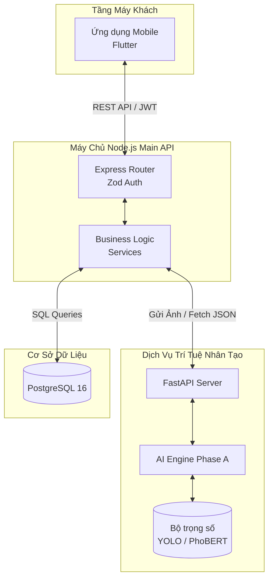

```mermaid
flowchart TD
    subgraph Client [Tầng Máy Khách]
        App[Ứng dụng Mobile<br>Flutter]
    end

    subgraph Backend_Server [Máy Chủ Node.js Main API]
        Router[Express Router<br>Zod Auth]
        Service[Business Logic<br>Services]
        Router <--> Service
    end

    subgraph AI_Server [Dịch Vụ Trí Tuệ Nhân Tạo]
        FastAPI[FastAPI Server]
        Pipeline[AI Engine Phase A]
        Models[(Bộ trọng số<br>YOLO / PhoBERT)]
        FastAPI <--> Pipeline
        Pipeline <--> Models
    end

    subgraph Database [Cơ Sở Dữ Liệu]
        PG[(PostgreSQL 16)]
    end

    App <--->|REST API / JWT| Router
    Service <--->|Gửi Ảnh / Fetch JSON| FastAPI
    Service <--->|SQL Queries| PG
```
