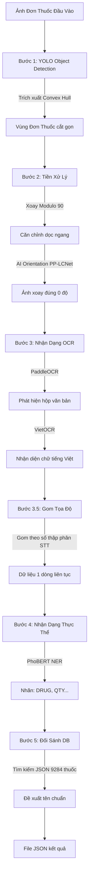

```mermaid
flowchart TD
    In[Ảnh Đơn Thuốc Đầu Vào] ---> S1[Bước 1: YOLO Object Detection]
    S1 --->|Trích xuất Convex Hull| Crop[Vùng Đơn Thuốc cắt gọn]
    
    Crop ---> S2[Bước 2: Tiền Xử Lý]
    S2 --->|Xoay Modulo 90| Deskew[Căn chỉnh dọc ngang]
    Deskew --->|AI Orientation PP-LCNet| D0[Ảnh xoay đúng 0 độ]
    
    D0 ---> S3[Bước 3: Nhận Dạng OCR]
    S3 --->|PaddleOCR| Box[Phát hiện hộp văn bản]
    Box --->|VietOCR| Text[Nhận diện chữ tiếng Việt]
    
    Text ---> S35[Bước 3.5: Gom Tọa Độ]
    S35 --->|Gom theo số thập phân STT| Line[Dữ liệu 1 dòng liên tục]
    
    Line ---> S4[Bước 4: Nhận Dạng Thực Thể]
    S4 --->|PhoBERT NER| NER[Nhãn: DRUG, QTY...]
    
    NER ---> S5[Bước 5: Đối Sánh DB]
    S5 --->|Tìm kiếm JSON 9284 thuốc| Fuzzy[Đề xuất tên chuẩn]
    
    Fuzzy ---> Out[File JSON kết quả]
```
