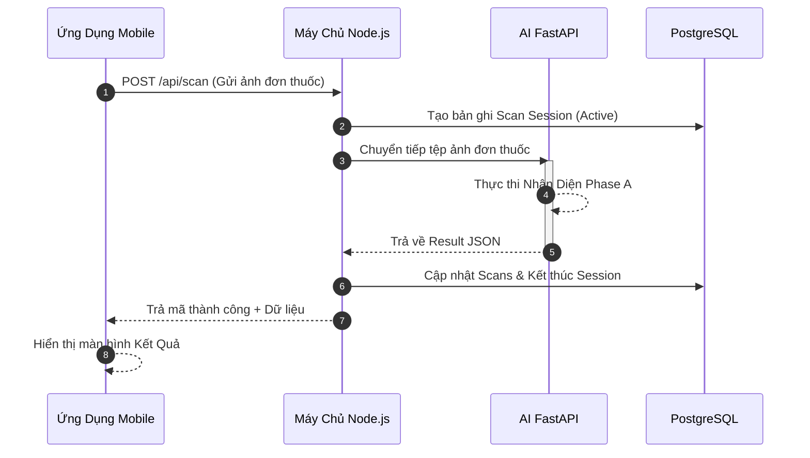

```mermaid
sequenceDiagram
    autonumber
    participant App as Ứng Dụng Mobile
    participant Node as Máy Chủ Node.js
    participant AI as AI FastAPI
    participant DB as PostgreSQL

    App->>Node: POST /api/scan (Gửi ảnh đơn thuốc)
    Node->>DB: Tạo bản ghi Scan Session (Active)
    Node->>AI: Chuyển tiếp tệp ảnh đơn thuốc
    activate AI
    AI-->>AI: Thực thi Nhận Diện Phase A
    AI-->>Node: Trả về Result JSON
    deactivate AI
    Node->>DB: Cập nhật Scans & Kết thúc Session
    Node-->>App: Trả mã thành công + Dữ liệu
    App-->>App: Hiển thị màn hình Kết Quả
```
