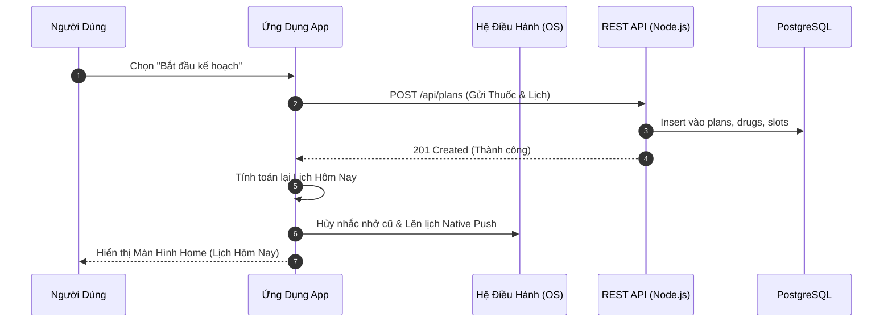

```mermaid
sequenceDiagram
    autonumber
    participant User as Người Dùng
    participant Mob as Ứng Dụng App
    participant LocalPush as Hệ Điều Hành (OS)
    participant Node as REST API (Node.js)
    participant DB as PostgreSQL

    User->>Mob: Chọn "Bắt đầu kế hoạch"
    Mob->>Node: POST /api/plans (Gửi Thuốc & Lịch)
    Node->>DB: Insert vào plans, drugs, slots
    Node-->>Mob: 201 Created (Thành công)
    
    Mob->>Mob: Tính toán lại Lịch Hôm Nay
    Mob->>LocalPush: Hủy nhắc nhở cũ & Lên lịch Native Push
    Mob-->>User: Hiển thị Màn Hình Home (Lịch Hôm Nay)
```
