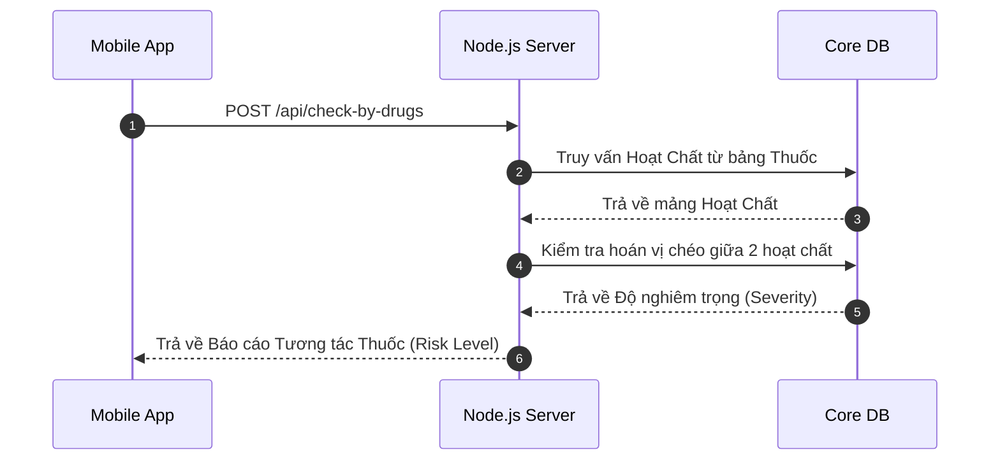

```mermaid
sequenceDiagram
    autonumber
    participant App as Mobile App
    participant Node as Node.js Server
    participant DB as Core DB

    App->>Node: POST /api/check-by-drugs
    Node->>DB: Truy vấn Hoạt Chất từ bảng Thuốc
    DB-->>Node: Trả về mảng Hoạt Chất
    Node->>DB: Kiểm tra hoán vị chéo giữa 2 hoạt chất
    DB-->>Node: Trả về Độ nghiêm trọng (Severity)
    Node-->>App: Trả về Báo cáo Tương tác Thuốc (Risk Level)
```
