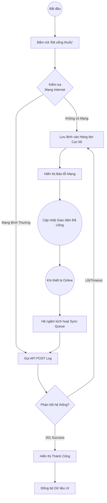

```mermaid
flowchart TD
    Start((Bắt đầu)) ---> Action[Bấm nút 'Đã uống thuốc']
    Action ---> Check{Kiểm tra<br>Mạng Internet}
    
    Check -- Không có Mạng ---> OfflineQueue[Lưu lệnh vào Hàng đợi Cục bộ]
    OfflineQueue ---> ShowWarning[Hiển thị Báo lỗi Mạng]
    ShowWarning ---> End((Cập nhật Giao diện Đã Uống))
    
    Check -- Mạng Bình Thường ---> APICall[Gọi API POST Log]
    
    APICall ---> BackendCheck{Phản hồi hệ thống?}
    BackendCheck -- Lỗi/Timeout ---> OfflineQueue
    BackendCheck -- 201 Success ---> ShowSuccess[Hiển thị Thành Công]
    ShowSuccess ---> SyncDose[Đồng bộ Dữ liệu UI]
    
    End ---> Reconnect((Khi thiết bị Online))
    Reconnect ---> Flush[Hệ ngầm kích hoạt Sync Queue]
    Flush ---> APICall
```
